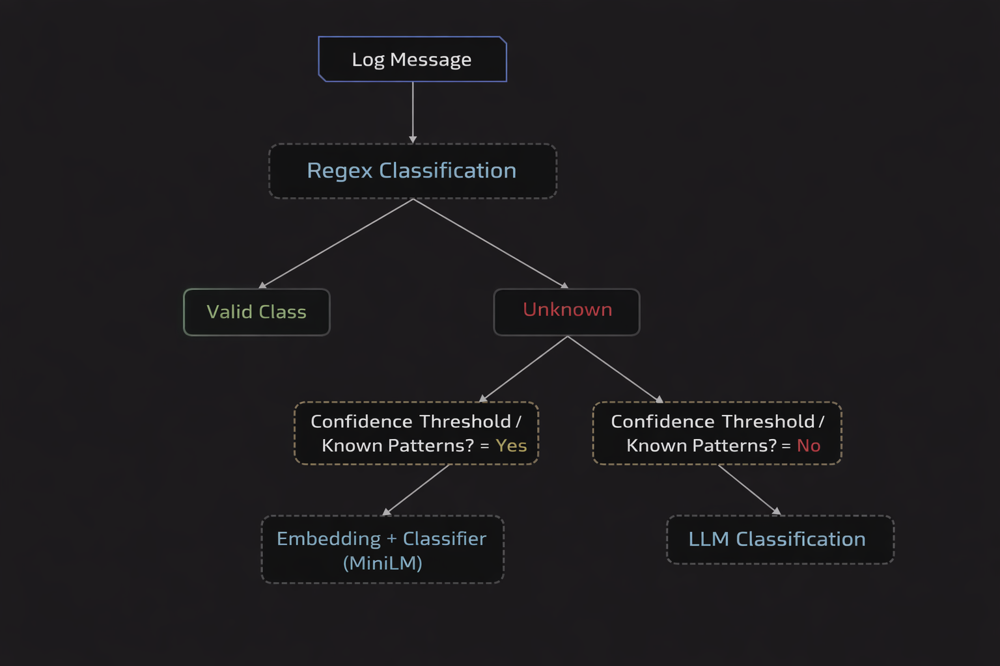

# Log Classification System — Hybrid AI Pipeline

## 📌 Overview

This project implements a **hybrid log classification system** that combines **rule-based methods, embedding-based machine learning, and LLM-based reasoning** in a cascaded pipeline.

The system is designed to:
- Efficiently classify structured and unstructured logs  
- Handle unseen or ambiguous log patterns  
- Balance **latency, cost, and accuracy** in a production-style setup  

## 🧠 Architecture

### Cascaded Inference Pipeline
Log Message  
↓  
Regex Classification (Rule-Based)  
↓ (if no match)  
Embedding + Classifier (BERT-based MiniLM)  
↓ (if low confidence / special source)  
LLM Classification (LLaMA 3)  

   

  

## ⚙️ Core Components

### 1. Rule-Based Classification (Regex)

- Uses predefined regex patterns for structured logs  
- Handles common categories such as:
  - User actions  
  - System notifications  
- Acts as the **fastest layer** in the pipeline  

**Characteristics:**
- Deterministic  
- No training required  
- High precision for known patterns 

### 2. BERT-Based Embedding + Classification

#### Model  
- all-MiniLM-L6-v2 (Sentence Transformers)  
- A **distilled BERT-family MiniLM (Sentence-BERT)**  

#### Approach  
- Convert log messages into **dense semantic embeddings**  
- Use a **supervised classifier** (loaded via `joblib`) on top of embeddings  
log → embedding (MiniLM) → classifier → label

#### Why this approach  
- Captures semantic meaning of logs  
- Handles variations in log format  
- More efficient than full BERT fine-tuning   

### Confidence Thresholding

- Uses prediction probabilities to filter low-confidence outputs  

if max(probabilities) < 0.5:
    return "Unclassified" 

### 3. LLM-Based Classification (Fallback Layer)
#### Model
- LLaMA 3 (via Groq API)
#### Method
- Prompt-based classification
- Structured output enforced using tags

#### Role
Handles:
- Ambiguous logs
- Rare/unseen patterns
- Inconsistent legacy logs 

### 4. Source-Aware Routing
if source == "LegacyCRM": 
    use LLM 
else: 
    use Regex → ML → fallback 
   
- Legacy systems → directly handled by LLM
- Modern systems → processed through efficient pipeline 

#### 🔍 Unsupervised Learning (DBSCAN)
- Algorithm
  - DBSCAN (Density-Based Clustering)
- Usage
  - Applied during data exploration phase
- Purpose
  - Identify clusters of similar logs
  - Detect outliers (noise points)
- Impact
  - Improved understanding of log distribution
  - Assisted in labeling strategy
  - Helped identify edge cases handled by LLM  

## 🛠️ Tech Stack
#### AI / ML
- Sentence Transformers (MiniLM - BERT-family)
- Scikit-learn
- DBSCAN (clustering)
#### LLM
- LLaMA 3 (Groq API)
- Prompt Engineering
- Regex-based output parsing
#### Backend
- FastAPI
- Pandas
- Python
#### Utilities
- Joblib (model loading)
- dotenv (environment variables)  

## 📊 Key Features
- Hybrid pipeline (Rule-based + ML + LLM)
- BERT-based semantic embeddings for log understanding
- Confidence-based classification filtering
- Outlier-aware design using DBSCAN insights
- Source-aware intelligent routing
- Batch processing via API  

## 📈 Future Improvements
- Fine-tuning transformer models on log-specific data
- Active learning for continuous model updates
- LLM response caching
- Real-time log streaming support
- Model monitoring and evaluation metrics 
